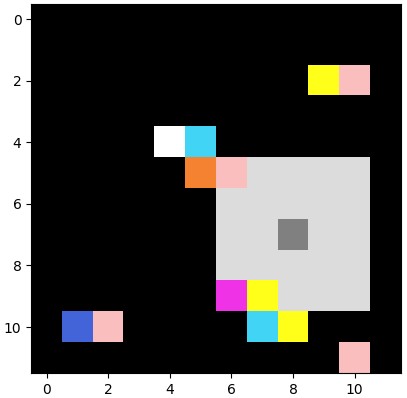

# Viewport BoxWorld

## Introduction

This repository is a fork of [[nathangrinsztajn/Box-World](https://github.com/nathangrinsztajn/Box-World)].
I customized to Viewport-BoxWorld described in the [[paper](https://arxiv.org/abs/1806.01822)].

<p align="center">
 
</p>

## State

The game provides tuple as a state. These are viewport map,
owned key color, and position of player.

 | states | shape | note |
 | ------ | ----- | ---- |
 | viewport map | (k, k, 3) | k is viewport size, normalized to 0-1 |
 | owned key color | (3,) | normalized to 0-1 |
 | player position | (2,) | x-y coordinate, normalized to 0-1 |
 
## Action

The game provides 4 actions to interact with the environment. 
The mapping of the action numbers to the actual actions looks as follows

 | Action       | ID    | 
 | --------     | :---: | 
 | Move Up      | 0     |  
 | Move Down    | 1     | 
 | Move Left    | 2     |   
 | Move Right   | 3     |
 
 ## Quick Game
 
 ```bash
 python Human_playing_Commandline.py --gifs
```
